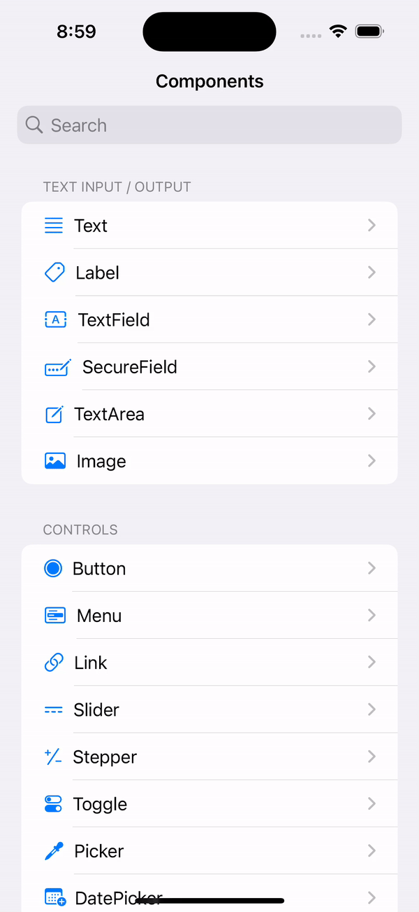
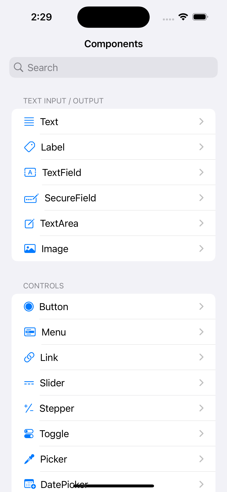
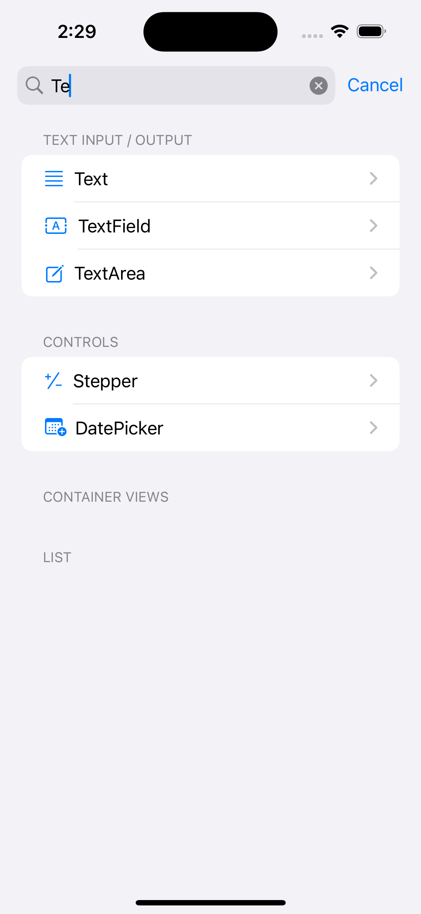
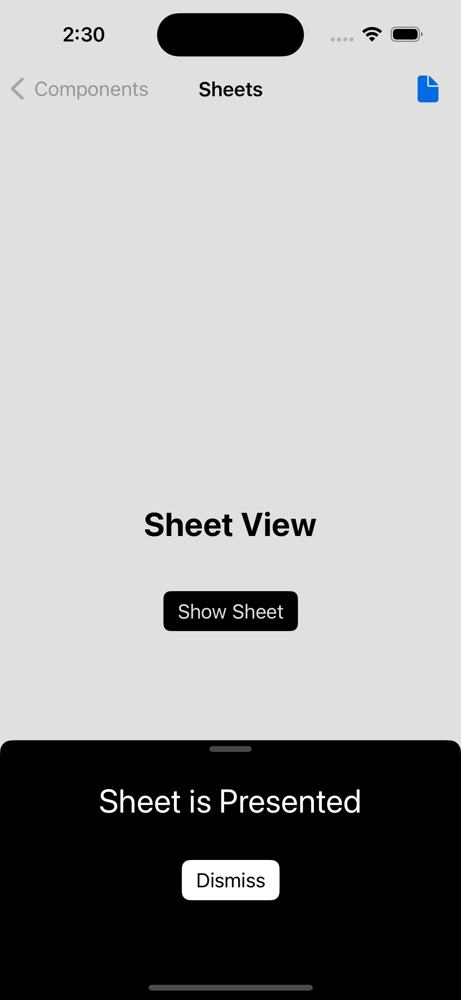

# Swift UI Components App

## This is an MVVM style built Components app, exploring various swift ui components and arrranging their separate views in a list of different sections

## Demo video

## Screenshots

